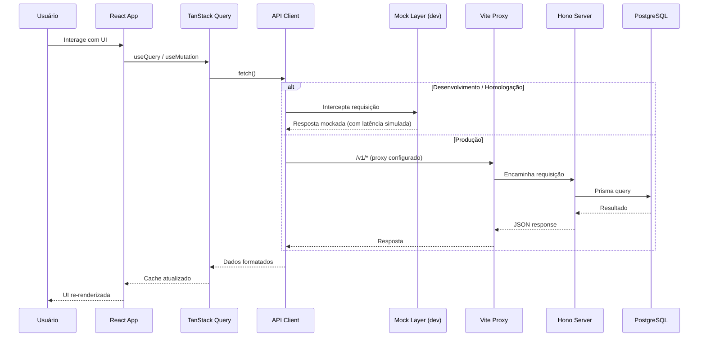
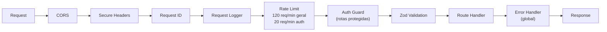

# Arquitetura Geral

## Visão

Documentar a arquitetura geral do sistema, fluxo entre frontend e backend, comunicação, estrutura dos módulos, organização das pastas, convenções e padrões de nomenclatura.

## Fluxo Frontend → Backend



## Comunicação

- **Formato:** JSON
- **Base URL:** `/v1/`
- **Proxy Vite (dev):** `/v1/*` → `http://localhost:3001/v1`
- **Autenticação:** Bearer JWT no header `Authorization`
- **Idempotência:** Requisições seguras (GET) são cacheadas pelo TanStack Query
- **Mutações:** POST/PUT/PATCH/DELETE invalidam cache automaticamente

## Padrão de resposta

### Sucesso

```json
{
  "success": true,
  "data": { ... },
  "meta": { "timestamp": "...", "requestId": "..." }
}
```

### Sucesso paginado

```json
{
  "success": true,
  "data": [ ... ],
  "meta": {
    "timestamp": "...",
    "requestId": "...",
    "page": 1,
    "perPage": 50,
    "total": 100,
    "totalPages": 2,
    "hasNext": true,
    "hasPrev": false
  }
}
```

### Erro

```json
{
  "success": false,
  "error": {
    "code": "VALIDATION_ERROR",
    "message": "Dados inválidos",
    "details": { "email": ["E-mail inválido"] }
  },
  "meta": { "timestamp": "...", "requestId": "..." }
}
```

## Códigos de erro padronizados

| Código             | HTTP | Descrição                      |
| ------------------ | ---- | ------------------------------ |
| `BAD_REQUEST`      | 400  | Requisição mal formatada       |
| `UNAUTHORIZED`     | 401  | Token ausente ou inválido      |
| `FORBIDDEN`        | 403  | Sem permissão                  |
| `NOT_FOUND`        | 404  | Recurso não encontrado         |
| `CONFLICT`         | 409  | Conflito (ex: email duplicado) |
| `VALIDATION_ERROR` | 422  | Dados inválidos (Zod)          |
| `SERVER_ERROR`     | 500  | Erro interno                   |

## Middleware Pipeline (Backend)



## Estratégia de versionamento

- **API:** URL versionada (`/v1/`, `/v2/` no futuro)
- **Banco:** Migrations Prisma versionadas sequencialmente
- **Git:** Conventional Commits (`feat:`, `fix:`, `chore:`, etc.)
- **Release:** GitHub Releases com semver (v1.0.0, v1.1.0, etc.)

## Convenções de nomenclatura

| Contexto           | Padrão      | Exemplo                             |
| ------------------ | ----------- | ----------------------------------- |
| Arquivos TS/TSX    | kebab-case  | `appointment-card.tsx`              |
| Componentes React  | PascalCase  | `AppointmentCard`                   |
| Funções/ hooks     | camelCase   | `useAgendaData`                     |
| Pastas             | kebab-case  | `pos-atendimento/`                  |
| Rotas API          | kebab-case  | `POST /v1/pos-atendimento/feedback` |
| Tabelas Prisma     | PascalCase  | `Appointment`, `TeamMember`         |
| Colunas DB         | camelCase   | `createdAt`, `businessName`         |
| Variáveis ambiente | UPPER_SNAKE | `DATABASE_URL`, `JWT_SECRET`        |
