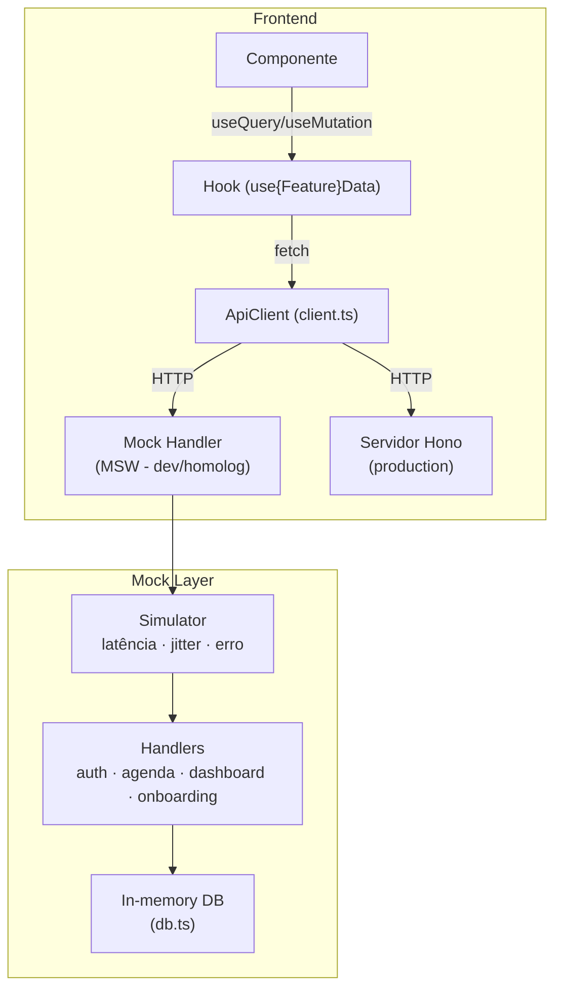
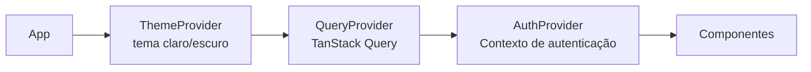

# Frontend — StudioHub

## Visão

Definir a organização do frontend React: quando consumir API, usar React Query, Zustand, Server/Client Components, hooks, services, providers.

## Decisões de uso

| Tecnologia                | Quando usar                                                                                                              |
| ------------------------- | ------------------------------------------------------------------------------------------------------------------------ |
| **API (fetch)**           | Toda comunicação com backend passa pelo `ApiClient` em `@/lib/api/client.ts`. Nunca chamar fetch diretamente.            |
| **TanStack Query**        | Todo dado assíncrono do servidor. `useQuery` para leitura, `useMutation` para escrita. Cache gerenciado automaticamente. |
| **Zustand**               | Não utilizado no projeto. Estado global é gerenciado por React Query (server state) + Context (auth, theme).             |
| **Server Components**     | Não utilizado. O App é Client-Side Rendered (Vite SPA).                                                                  |
| **Client Components**     | Todos os componentes são Client Components.                                                                              |
| **Server Actions**        | Não utilizado. O backend é separado (Hono.js).                                                                           |
| **Route Handlers**        | Não utilizado. O backend Hono.js é o servidor de API.                                                                    |
| **React Hook Form + Zod** | Todo formulário. RHF gerencia estado, Zod valida no submit. Esquemas compartilhados com backend.                         |

## Estrutura de features

Cada feature em `src/features/{domain}/` contém:

```
features/agenda/
├── components/       # Componentes específicos da feature
│   ├── appointment-card.tsx
│   ├── appointment-list.tsx
│   └── calendar-header.tsx
├── hooks/            # Hooks específicos (data fetching)
│   └── use-agenda-data.ts
├── pages/            # Páginas da feature
│   └── agenda-page.tsx
├── types.ts          # Tipos específicos
├── data.ts           # Mock data (até migrar para API real)
└── index.ts          # Barrel export
```

## Organização de componentes

```
components/
├── ui/               # Componentes atômicos (Radix UI wrappers)
│   ├── button.tsx
│   ├── card.tsx
│   ├── input.tsx
│   ├── badge.tsx
│   ├── avatar.tsx
│   ├── skeleton.tsx
│   ├── dropdown-menu.tsx
│   ├── tooltip.tsx
│   ├── scroll-area.tsx
│   ├── separator.tsx
│   ├── loading.tsx
│   ├── page-loader.tsx
│   └── state-panel.tsx
├── layout/           # Componentes de layout
│   ├── app-sidebar.tsx
│   ├── app-header.tsx
│   └── app-breadcrumb.tsx
├── landing/          # Landing page
│   ├── Header.tsx
│   ├── Hero.tsx
│   ├── Benefits.tsx
│   ├── Segments.tsx
│   ├── Testimonials.tsx
│   ├── Plans.tsx
│   ├── FAQ.tsx
│   ├── CTA.tsx
│   └── Footer.tsx
└── chatbot/          # Chatbot IA
    ├── Chatbot.tsx
    ├── use-chatbot.ts
    └── format-message.tsx
```

## Camada de API



## Providers



## Hooks globais

| Hook                 | Localização                   | Função                                  |
| -------------------- | ----------------------------- | --------------------------------------- |
| `use-media-query`    | `src/hooks/`                  | Responsividade                          |
| `use-online-status`  | `src/hooks/`                  | Status de conexão                       |
| `use-reduced-motion` | `src/hooks/`                  | Acessibilidade (prefers-reduced-motion) |
| `use-focus-trap`     | `src/hooks/`                  | Acessibilidade (modal focus trap)       |
| `useMotionConfig`    | `src/lib/animation/motion.ts` | Configuração de animação                |

## Roteamento

| Path                   | Componente                     | Auth | Público |
| ---------------------- | ------------------------------ | ---- | ------- |
| `/`                    | LandingPage                    | -    | Sim     |
| `/cadastro`            | OnboardingPage                 | -    | Sim     |
| `/login`               | LoginPage                      | -    | Sim     |
| `/app`                 | AuthGuard → AppLayout → Outlet | Sim  | -       |
| `/app/`                | DashboardPage                  | Sim  | -       |
| `/app/agendamentos`    | AgendaPage                     | Sim  | -       |
| `/app/atendimento`     | AtendimentoPage                | Sim  | -       |
| `/app/pos-atendimento` | PosAtendimentoPage             | Sim  | -       |
| `/app/relatorios`      | RelatoriosPage                 | Sim  | -       |
| `/app/fidelizacao`     | FidelizacaoPage                | Sim  | -       |
| `/app/pagamentos`      | PagamentoPage                  | Sim  | -       |
| `/app/analytics`       | AnalyticsPage                  | Sim  | -       |
| `/app/clientes`        | ClientesPage                   | Sim  | -       |
| `/app/servicos`        | ServicosPage                   | Sim  | -       |
| `/app/equipe`          | EquipePage                     | Sim  | -       |
| `/app/configuracoes`   | ConfiguracoesPage              | Sim  | -       |

## Tratamento de estados

Todo hook de dados retorna um objeto padronizado:

```typescript
interface AsyncState<T> {
  data: T | undefined
  isLoading: boolean
  isError: boolean
  error: Error | null
  refetch: () => void
}
```

Os componentes usam `StatePanel` para exibir loading, erro ou vazio de forma consistente.
