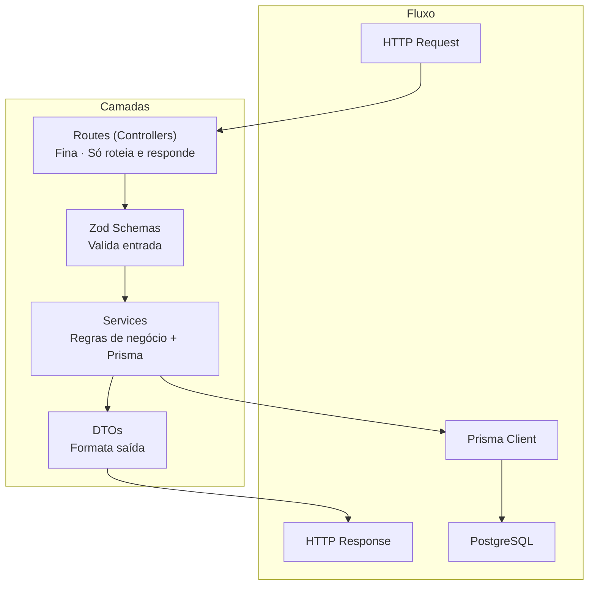
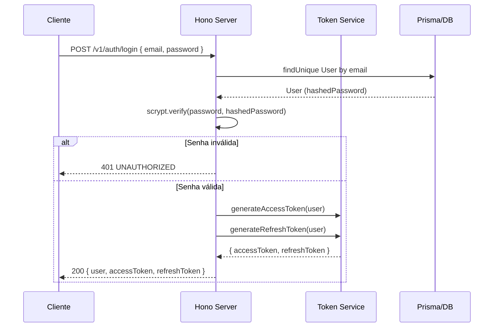

# Backend — StudioHub

## Visão

Arquitetura do backend Hono.js: camadas, controllers, services, repositories, DTOs, schemas, middlewares, validação, tratamento de erros, logs, autenticação, autorização e multiempresa.

## Stack

- **Runtime:** Node.js 20+
- **Framework:** Hono.js 4
- **Validação:** Zod 4
- **ORM:** Prisma 7 + `@prisma/adapter-pg`
- **Auth:** JWT (HS256) + Refresh Token
- **Password:** scrypt com salt + timingSafeEqual

## Camadas



## Estrutura

```
server/
├── index.ts               # Bootstrap + middlewares globais
├── lib/                   # Infraestrutura
│   ├── auth.ts            # Helpers de autenticação
│   ├── cache.ts           # Cache em memória
│   ├── crypto.ts          # Hashing scrypt
│   ├── error-handler.ts   # Tratador global de erros
│   ├── errors.ts          # Classes de erro (AppError, etc.)
│   ├── logger.ts          # Logger de requisições
│   ├── middleware.ts       # requestId, authGuard
│   ├── rate-limit.ts      # Rate limiting por IP
│   ├── response.ts        # Helpers de resposta padronizada
│   ├── roles.ts           # Controle de acesso por papel
│   ├── token.ts           # JWT creation/verification
│   └── validate.ts        # Middleware de validação Zod
├── routes/                # Controllers HTTP
│   ├── auth.ts
│   ├── agenda.ts
│   ├── clientes.ts
│   └── ... (12 módulos)
├── schemas/               # Zod schemas
│   ├── index.ts
│   ├── auth.ts
│   ├── agenda.ts
│   └── ... (12 módulos)
├── dto/                   # Data Transfer Objects
│   ├── index.ts
│   ├── auth.ts
│   ├── agenda.ts
│   └── ... (12 módulos)
└── services/              # Regras de negócio
    ├── auth.ts
    ├── agenda.ts
    ├── clientes.ts
    └── ... (12 módulos)
```

## Domínios

| Domínio         | Rotas                   | Descrição                                         |
| --------------- | ----------------------- | ------------------------------------------------- |
| Auth            | `/v1/auth/*`            | Cadastro, login, refresh, logout, me              |
| Agenda          | `/v1/agenda/*`          | CRUD agendamentos, confirmar, cancelar, reagendar |
| Atendimentos    | `/v1/atendimentos/*`    | Sessões de serviço                                |
| Clientes        | `/v1/clientes/*`        | CRUD clientes                                     |
| Configurações   | `/v1/configuracoes/*`   | Preferências da empresa                           |
| Dashboard       | `/v1/dashboard/*`       | Métricas, hoje, analytics, status                 |
| Equipe          | `/v1/equipe/*`          | CRUD membros                                      |
| Fidelização     | `/v1/fidelizacao/*`     | Pontos, promoções, transações                     |
| Onboarding      | `/v1/onboarding/*`      | Setup inicial                                     |
| Pagamentos      | `/v1/pagamentos/*`      | PIX, crédito, débito, dinheiro                    |
| Pós-Atendimento | `/v1/pos-atendimento/*` | Feedback, campanhas                               |
| Relatórios      | `/v1/relatorios/*`      | KPIs por período                                  |
| Serviços        | `/v1/servicos/*`        | CRUD serviços                                     |

## Autenticação



## Multiempresa

O modelo atual utiliza **uma conta por estabelecimento** (`User` como tenant). Cada `User` possui seus próprios dados:

- `BusinessHour`
- `Service`
- `TeamMember`
- `Cliente`
- `Appointment`
- `Atendimento`
- `Payment`
- `LoyaltyProgram`
- `ClientPoints`
- `LoyaltyPromotion`
- `Feedback`
- `Campaign`

Todas as queries Prisma são filtradas por `userId` extraído do token JWT no middleware `authGuard`.

## Tratamento de erros

```typescript
// Error global handler (server/lib/error-handler.ts)
app.onError((err, c) => {
  if (isAppError(err)) {
    return error(c, err.statusCode, err.code, err.message, err.details)
  }
  // Erro não mapeado → 500
  console.error(`[UNHANDLED] ${err}`)
  return serverError(c)
})
```

## Validação

```typescript
// Exemplo: esquema Zod + middleware validate
const loginSchema = z.object({
  email: z.string().email(),
  password: z.string().min(6),
})

app.post('/v1/auth/login', validate(loginSchema), (c) => {
  const { email, password } = c.req.valid('json')
  // ...
})
```
