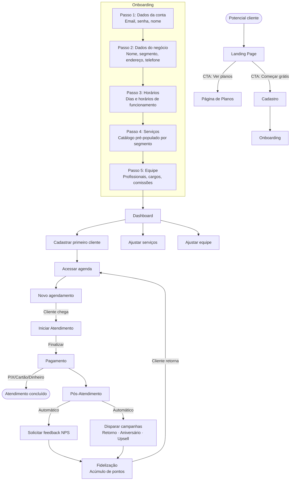
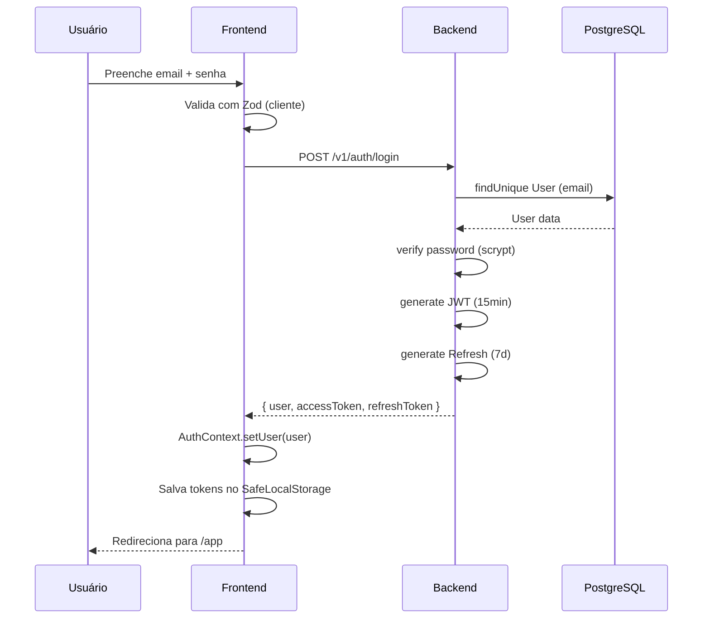
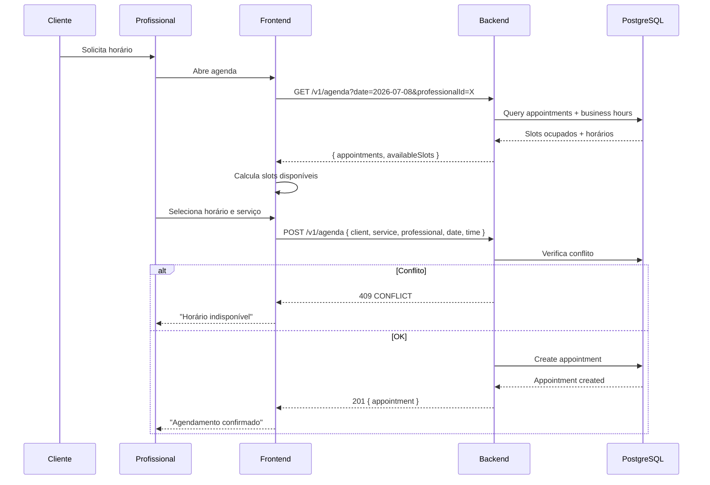
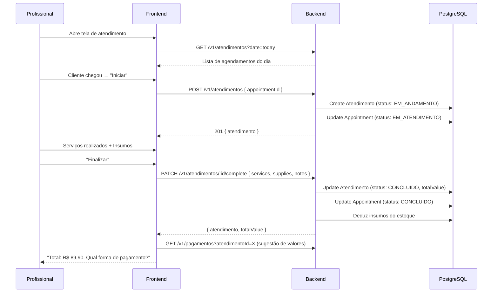
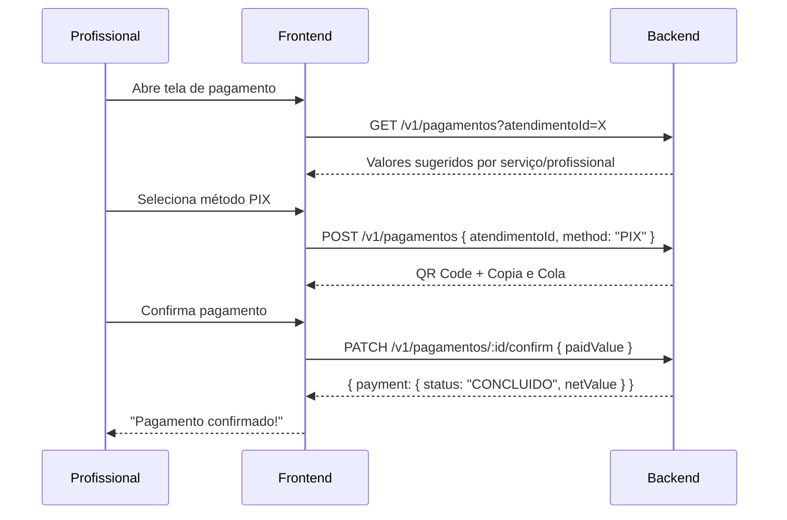
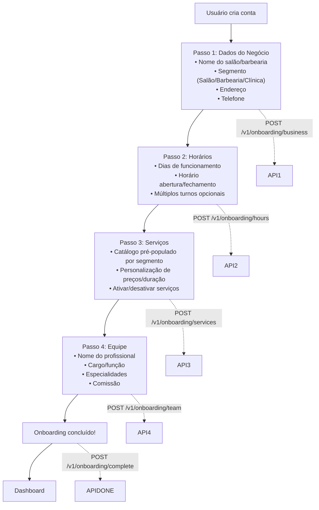
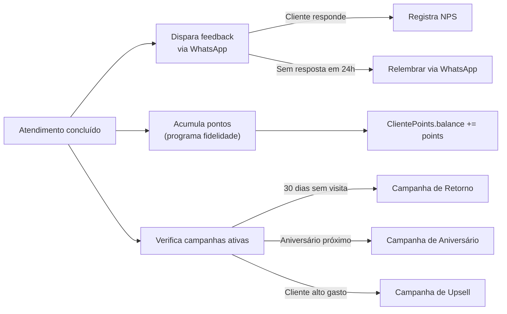

# Fluxos — StudioHub

## Visão

Fluxos completos da jornada do usuário, desde o primeiro contato até a operação diária.

## Fluxo completo do cliente

## Fluxo de autenticação

## Fluxo de agendamento

## Fluxo de atendimento

## Fluxo de pagamento

## Fluxo de onboarding

## Fluxo de pós-atendimento e fidelização

## Responsabilidades por papel

| Papel            | Ações                                                                        |
| ---------------- | ---------------------------------------------------------------------------- |
| **Proprietário** | Configurar negócio, ver dashboard, gerenciar equipe/serviços, ver relatórios |
| **Profissional** | Ver agenda, realizar atendimento, registrar pagamento                        |
| **Cliente**      | Agendar (futuro: autoatendimento), receber lembretes, dar feedback           |
