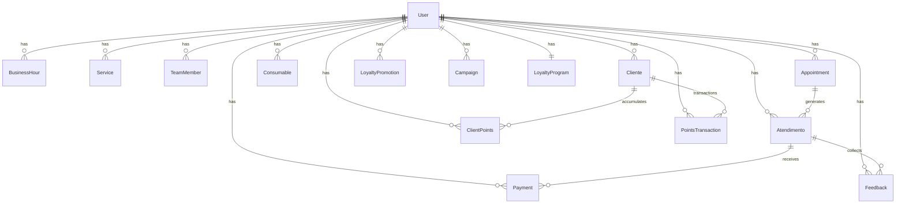

# Banco de Dados — StudioHub

## Visão

Modelagem completa do banco PostgreSQL via Prisma ORM. Relacionamentos, índices, constraints, migrations, seed e soft delete.

## Modelos (18)



### User (Conta do estabelecimento)

| Campo               | Tipo     | Descrição                 |
| ------------------- | -------- | ------------------------- |
| id                  | UUID     | PK                        |
| email               | String   | Único                     |
| name                | String   | Nome do proprietário      |
| hashedPassword      | String   | scrypt hash               |
| credits             | Int      | Créditos restantes        |
| plan                | Plan     | BASIC, PRO, PREMIUM       |
| businessName        | String   | -                         |
| businessSegment     | Segment  | SALAO, BARBEARIA, CLINICA |
| businessAddress     | String?  | -                         |
| businessPhone       | String   | -                         |
| businessLogo        | String?  | URL                       |
| onboardingCompleted | Boolean  | -                         |
| createdAt           | DateTime | -                         |
| updatedAt           | DateTime | -                         |

### BusinessHour (Horários de funcionamento)

| Campo     | Tipo    | Descrição |
| --------- | ------- | --------- |
| id        | UUID    | PK        |
| userId    | UUID    | FK → User |
| dayOfWeek | Int     | 0-6       |
| isOpen    | Boolean | -         |
| openTime  | String  | HH:mm     |
| closeTime | String  | HH:mm     |

### Service (Serviços)

| Campo    | Tipo    | Descrição |
| -------- | ------- | --------- |
| id       | UUID    | PK        |
| userId   | UUID    | FK → User |
| name     | String  | -         |
| duration | Int     | Minutos   |
| price    | Decimal | -         |
| category | String  | -         |
| active   | Boolean | -         |

### TeamMember (Equipe)

| Campo       | Tipo     | Descrição |
| ----------- | -------- | --------- |
| id          | UUID     | PK        |
| userId      | UUID     | FK → User |
| name        | String   | -         |
| role        | String   | -         |
| phone       | String   | -         |
| email       | String?  | -         |
| active      | Boolean  | -         |
| commission  | Decimal  | %         |
| specialties | String[] | Tags      |
| photo       | String?  | URL       |

### Cliente

| Campo        | Tipo      | Descrição                                 |
| ------------ | --------- | ----------------------------------------- |
| id           | UUID      | PK                                        |
| userId       | UUID      | FK → User                                 |
| nome         | String    | -                                         |
| email        | String?   | -                                         |
| telefone     | String    | -                                         |
| segmento     | String?   | -                                         |
| ultimaVisita | DateTime? | -                                         |
| totalVisitas | Int       | -                                         |
| totalGasto   | Decimal   | -                                         |
| status       | Status    | ATIVO, INATIVO, RECORRENTE, VIP, EM_RISCO |
| aniversario  | DateTime? | -                                         |
| createdAt    | DateTime  | -                                         |
| updatedAt    | DateTime  | -                                         |

Índices: `[userId, status]`, `[userId, nome]`

### Appointment (Agendamento)

| Campo            | Tipo              | Descrição                                                          |
| ---------------- | ----------------- | ------------------------------------------------------------------ |
| id               | UUID              | PK                                                                 |
| userId           | UUID              | FK → User                                                          |
| clientName       | String            | -                                                                  |
| clientPhone      | String            | -                                                                  |
| clientEmail      | String?           | -                                                                  |
| serviceId        | String            | -                                                                  |
| serviceName      | String            | -                                                                  |
| serviceDuration  | Int               | -                                                                  |
| servicePrice     | Decimal           | -                                                                  |
| professionalId   | String            | -                                                                  |
| professionalName | String            | -                                                                  |
| date             | DateTime          | Data                                                               |
| startTime        | String            | HH:mm                                                              |
| endTime          | String            | HH:mm                                                              |
| status           | AppointmentStatus | AGENDADO, CONFIRMADO, EM_ATENDIMENTO, CONCLUIDO, FALTOU, CANCELADO |
| notes            | String?           | -                                                                  |
| reminderSent     | Boolean           | -                                                                  |
| confirmationSent | Boolean           | -                                                                  |
| createdAt        | DateTime          | -                                                                  |
| updatedAt        | DateTime          | -                                                                  |

Índices: `[userId, date]`, `[userId, professionalId, date, status]`

### Atendimento (Sessão de serviço)

| Campo            | Tipo              | Descrição                   |
| ---------------- | ----------------- | --------------------------- |
| id               | UUID              | PK                          |
| userId           | UUID              | FK → User                   |
| appointmentId    | UUID?             | FK → Appointment            |
| clientName       | String            | -                           |
| clientPhone      | String            | -                           |
| professionalId   | String            | -                           |
| professionalName | String            | -                           |
| date             | DateTime          | -                           |
| startTime        | String            | HH:mm                       |
| endTime          | String            | HH:mm                       |
| services         | Json              | Array de serviços prestados |
| supplies         | Json              | Insumos utilizados          |
| notes            | String?           | -                           |
| status           | AtendimentoStatus | EM_ANDAMENTO, CONCLUIDO     |
| totalValue       | Decimal           | -                           |
| createdAt        | DateTime          | -                           |
| updatedAt        | DateTime          | -                           |

Índices: `[userId, date, status]`

### Payment (Pagamento)

| Campo            | Tipo          | Descrição                      |
| ---------------- | ------------- | ------------------------------ |
| id               | UUID          | PK                             |
| userId           | UUID          | FK → User                      |
| atendimentoId    | UUID?         | FK → Atendimento               |
| clientName       | String        | -                              |
| clientPhone      | String        | -                              |
| professionalName | String        | -                              |
| serviceNames     | String[]      | -                              |
| date             | DateTime      | -                              |
| totalValue       | Decimal       | -                              |
| method           | PaymentMethod | PIX, CREDITO, DEBITO, DINHEIRO |
| status           | PaymentStatus | PENDENTE, CONCLUIDO, ESTORNADO |
| paidValue        | Decimal       | -                              |
| feeValue         | Decimal       | Taxa                           |
| netValue         | Decimal       | Líquido                        |
| pixQrCode        | String?       | -                              |
| pixCopyPaste     | String?       | -                              |
| receiptNumber    | String?       | -                              |
| paidAt           | DateTime?     | -                              |
| createdAt        | DateTime      | -                              |
| updatedAt        | DateTime      | -                              |

Índices: `[userId, status]`, `[userId, atendimentoId]`

### Loyalty & Marketing

- **LoyaltyProgram**: Configuração do programa de pontos por estabelecimento
- **ClientPoints**: Saldo de pontos por cliente
- **PointsTransaction**: Histórico de movimentação de pontos
- **LoyaltyPromotion**: Promoções/resgates configurados
- **Feedback**: Avaliações NPS pós-atendimento
- **Campaign**: Campanhas de marketing automáticas

## Estratégia de índices

- Índices compostos nos campos mais consultados por domínio (`userId + status`, `userId + date`)
- Índices únicos para emails e telefones
- Índices de texto para buscas por nome (`@@` no PostgreSQL)

## Migrations

```bash
pnpm db:migrate        # Cria/roda migrations em dev
pnpm db:push           # Push direto do schema (sem migration)
pnpm db:seed           # Popula com dados de teste
pnpm db:studio         # Prisma Studio GUI
```

## Seed

O seed cria 3 usuários de teste:

| Email             | Nome         | Segmento  | Plano   |
| ----------------- | ------------ | --------- | ------- |
| homem@teste.com   | Carlos Silva | Barbearia | Pro     |
| mulher@teste.com  | Ana Costa    | Salão     | Pro     |
| lojista@teste.com | Studio Hub   | Salão     | Premium |

Cada um com: agenda de horários, equipe, serviços, clientes, agendamentos (~66), atendimentos (~36), pagamentos (~36), feedbacks, campanhas e programa de fidelidade.

## Soft Delete

O sistema utiliza **delete físico** (não soft delete) por simplicidade, já que o negócio não exige recuperação de dados deletados. Caso necessário no futuro, basta adicionar `deletedAt: DateTime?` nos modelos relevantes.

---

> **Última atualização:** 2026-07-21 | **Responsável:** Equipe StudioHub
