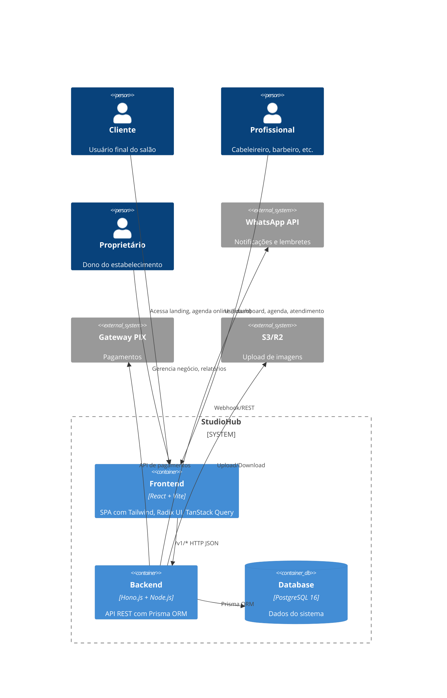
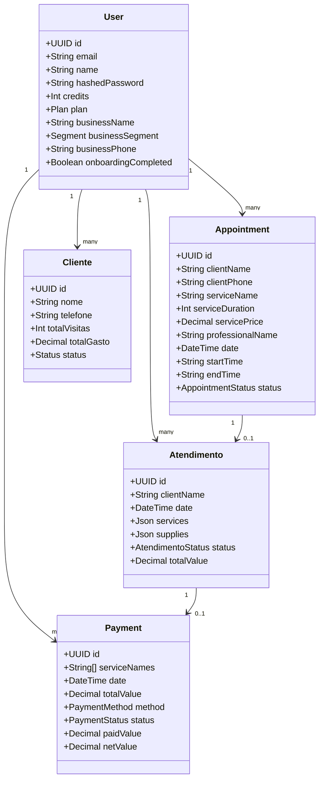
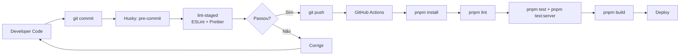

# Diagramas de Arquitetura

## Arquitetura completa do sistema



## Fluxo de dados

```mermaid
flowchart TB
    subgraph Frontend
        COMP[Components React]
        HOOKS[Hooks use{*}Data]
        API_CLIENT[ApiClient]
        MOCK[MSW Mock Layer]
    end

    subgraph Backend
        HONO[Hono Router]
        AUTH[Auth Middleware]
        RATE[Rate Limit]
        ROUTES[Route Handlers]
        ZOD[Zod Validation]
        SERVICES[Business Services]
        DTO[DTO Formatters]
    end

    subgraph Data
        PRISMA[Prisma ORM]
        PG[(PostgreSQL)]
    end

    COMP --> HOOKS
    HOOKS --> API_CLIENT
    API_CLIENT --> MOCK
    MOCK --> HOOKS
    API_CLIENT --> HONO
    HONO --> AUTH
    AUTH --> RATE
    RATE --> ROUTES
    ROUTES --> ZOD
    ZOD --> SERVICES
    SERVICES --> DTO
    DTO --> ROUTES
    SERVICES --> PRISMA
    PRISMA --> PG
```

## Modelo de domínio



## Pipeline de qualidade



---

> **Última atualização:** 2026-07-21 | **Responsável:** Equipe StudioHub
