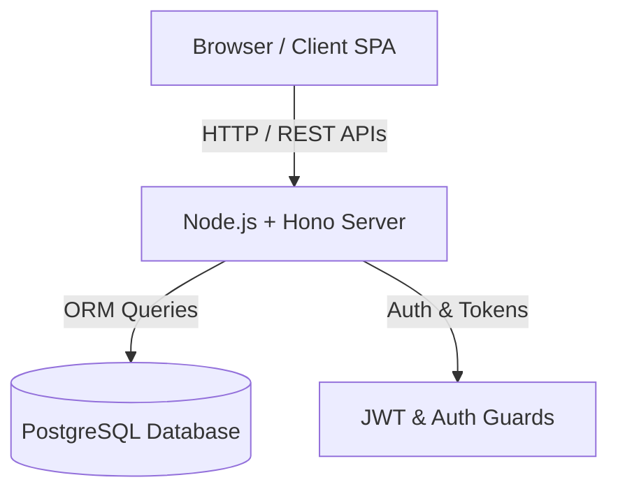

# Visão Geral da Arquitetura — StudioHub

## Objetivo

Descrever a arquitetura técnica global do StudioHub, seus pilares de design, camadas de software e integrações entre Frontend, Backend e Banco de Dados.

## Contexto

O **StudioHub** é um ecossistema SaaS voltado para a gestão operacional e financeira de barbearias e salões de beleza. A aplicação opera sob um modelo multiempresa (_multi-tenant_ por usuário/dono de negócio), provendo agendamento inteligente, controle de atendimentos, fidelização e relatórios.

## Funcionamento

### Principais Tecnologias (Stack Core)

- **Frontend:** React 19, Vite, React Router DOM, Tailwind CSS v4, Lucide React, TanStack Query.
- **Backend API:** Node.js, Hono framework, Zod OpenAPI, `@hono/node-server`.
- **Banco de Dados:** PostgreSQL, Prisma ORM 7 (`@prisma/client`).
- **Autenticação & Segurança:** Hashing Argon2/Bcrypt, JWT, Role-based Access Control (RBAC).

## Responsáveis

- Equipe de Arquitetura & Engenharia StudioHub

---

> **Última atualização:** 2026-07-21 | **Responsável:** Software Architect
