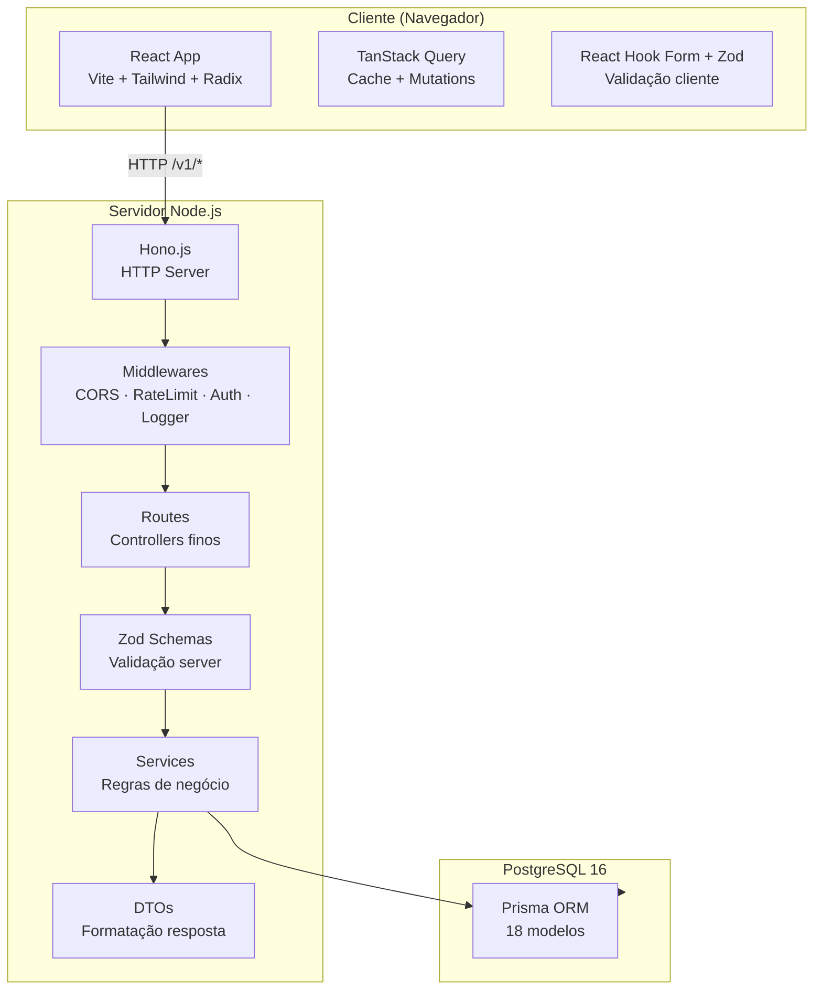

# Visão Geral — StudioHub

> **Nota:** O nome oficial do produto é **StudioHub**.

## Missão

Reduzir filas, organizar o atendimento, melhorar a experiência do cliente e otimizar a operação de salões de beleza, barbearias e clínicas estéticas.

Não somos apenas mais um sistema de agendamento. Somos uma plataforma SaaS completa de gestão.

## Stack

| Camada       | Tecnologia                | Versão     |
| ------------ | ------------------------- | ---------- |
| Frontend     | React + TypeScript + Vite | 19 / 6 / 8 |
| Estilização  | Tailwind CSS              | 4          |
| Componentes  | Radix UI                  | -          |
| Roteamento   | React Router DOM          | 7          |
| Formulários  | React Hook Form + Zod     | 7 / 4      |
| Server State | TanStack React Query      | 5          |
| Animação     | Framer Motion             | 12         |
| Backend      | Hono.js                   | 4          |
| ORM          | Prisma                    | 7          |
| Database     | PostgreSQL                | 16         |
| Testes       | Vitest + Testing Library  | 4          |
| Linter       | ESLint                    | 10         |

## Princípios

- **Separação por domínio** — cada feature tem seus schemas, DTOs, services e routes
- **Controllers finos** — routes só roteiam e respondem, sem lógica de negócio
- **Services concentram regras** — sem depender de HTTP
- **DTOs transformam modelos** — banco → formato que o frontend espera
- **Validação em camadas** — Zod nos endpoints + Tipagem TypeScript
- **KISS, SOLID e simplicidade** — sem overengineering
- **Pronto para auditoria** — decisões justificadas, código limpo

## Arquitetura em camadas



## Estrutura do monorepo

```
studiohub/
├── src/                    # Frontend React
│   ├── app/                # App root + rotas
│   ├── components/         # Componentes compartilhados
│   │   ├── ui/             # Radix UI wrappers
│   │   ├── layout/         # Sidebar, header, breadcrumb
│   │   ├── landing/        # Landing page components
│   │   └── chatbot/        # Chatbot IA
│   ├── features/           # Feature modules
│   │   ├── agenda/
│   │   ├── analytics/
│   │   ├── atendimento/
│   │   ├── auth/
│   │   ├── clientes/
│   │   ├── dashboard/
│   │   ├── equipe/
│   │   ├── fidelizacao/
│   │   ├── onboarding/
│   │   ├── pagamento/
│   │   ├── pos-atendimento/
│   │   ├── relatorios/
│   │   ├── servicos/
│   │   └── configuracoes/
│   ├── hooks/              # Hooks globais
│   ├── layouts/            # App layout (sidebar + header + outlet)
│   ├── lib/                # Utilitários compartilhados
│   │   ├── api/            # API client + mock layer
│   │   ├── db/             # Mock databases
│   │   ├── services/       # Services (chatbot, analytics, whatsapp)
│   │   ├── utils/          # cn, format
│   │   └── animation/      # Framer Motion config
│   ├── pages/              # Public pages (Landing, Login, Cadastro)
│   ├── providers/          # React providers (Theme, Query, Auth)
│   ├── data/               # Static content (landing data)
│   ├── styles/             # CSS global
│   └── types/              # Tipagens globais
├── server/                 # Backend Hono.js
│   ├── index.ts            # Bootstrap
│   ├── lib/                # Infraestrutura
│   ├── routes/             # Controllers HTTP
│   ├── schemas/            # Validação Zod
│   ├── services/           # Regras de negócio
│   └── dto/                # Data Transfer Objects
├── prisma/                 # ORM
│   ├── schema.prisma       # 18 modelos
│   ├── seed.ts             # Dados de teste
│   └── migrations/         # Migrations versionadas
└── studiohub-project/      # Documentação arquitetural
```
