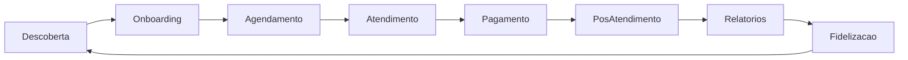

# Plano de Tasks — Jornada do Usuário

Portal parceiro para salões, barbearias, clínicas e profissionais de beleza independentes.

## Visão geral

Este diretório organiza o desenvolvimento incremental do produto em 8 etapas da jornada do usuário. Cada arquivo contém subtasks acionáveis, critérios de aceite e dependências.

| # | Etapa | Arquivo | Escopo principal |
|---|-------|---------|------------------|
| 01 | Descoberta | [01-descoberta.md](01-descoberta.md) | Landing page + chatbot IA |
| 02 | Onboarding | [02-onboarding.md](02-onboarding.md) | Cadastro rápido, setup automático |
| 03 | Agendamento | [03-agendamento.md](03-agendamento.md) | IA sugere horários e confirmações |
| 04 | Atendimento | [04-atendimento.md](04-atendimento.md) | Registro de serviços e insumos |
| 05 | Pagamento | [05-pagamento.md](05-pagamento.md) | Pix/cartão, insights financeiros |
| 06 | Pós-atendimento | [06-pos-atendimento.md](06-pos-atendimento.md) | Feedback + campanhas automáticas |
| 07 | Relatórios | [07-relatorios.md](07-relatorios.md) | Dashboard com métricas e recomendações |
| 08 | Fidelização | [08-fidelizacao.md](08-fidelizacao.md) | Promoções personalizadas e pontos |

## Fluxo da jornada

## Dependências entre etapas

| Etapa | Depende de | Desbloqueia |
|-------|------------|-------------|
| Descoberta | — | Onboarding |
| Onboarding | Descoberta | Agendamento, Atendimento, Pagamento |
| Agendamento | Onboarding | Atendimento, Pós-atendimento |
| Atendimento | Onboarding, Agendamento | Pagamento, Pós-atendimento, Relatórios |
| Pagamento | Atendimento | Relatórios, Fidelização |
| Pós-atendimento | Atendimento, Agendamento | Relatórios, Fidelização |
| Relatórios | Atendimento, Pagamento, Pós-atendimento | Fidelização |
| Fidelização | Relatórios, Pós-atendimento | Descoberta (ciclo de retenção) |

## Ordem sugerida de implementação

1. **Descoberta** — aquisição e primeiro contato
2. **Onboarding** — base de dados do negócio e usuários
3. **Agendamento** — core operacional
4. **Atendimento** — registro do serviço prestado
5. **Pagamento** — monetização e conciliação
6. **Pós-atendimento** — engajamento pós-visita
7. **Relatórios** — visibilidade e decisões
8. **Fidelização** — retenção e crescimento recorrente

## Como usar

1. Escolha a etapa atual ou a próxima desbloqueada na tabela de dependências.
2. Abra o arquivo correspondente e trabalhe nas subtasks em ordem.
3. Marque cada subtask como concluída (`[x]`) ao finalizar.
4. Valide os critérios de aceite antes de considerar a etapa completa.
